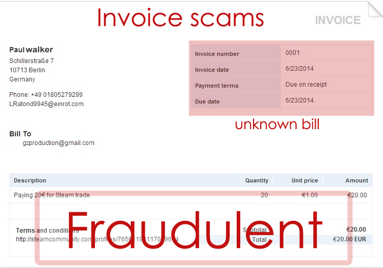
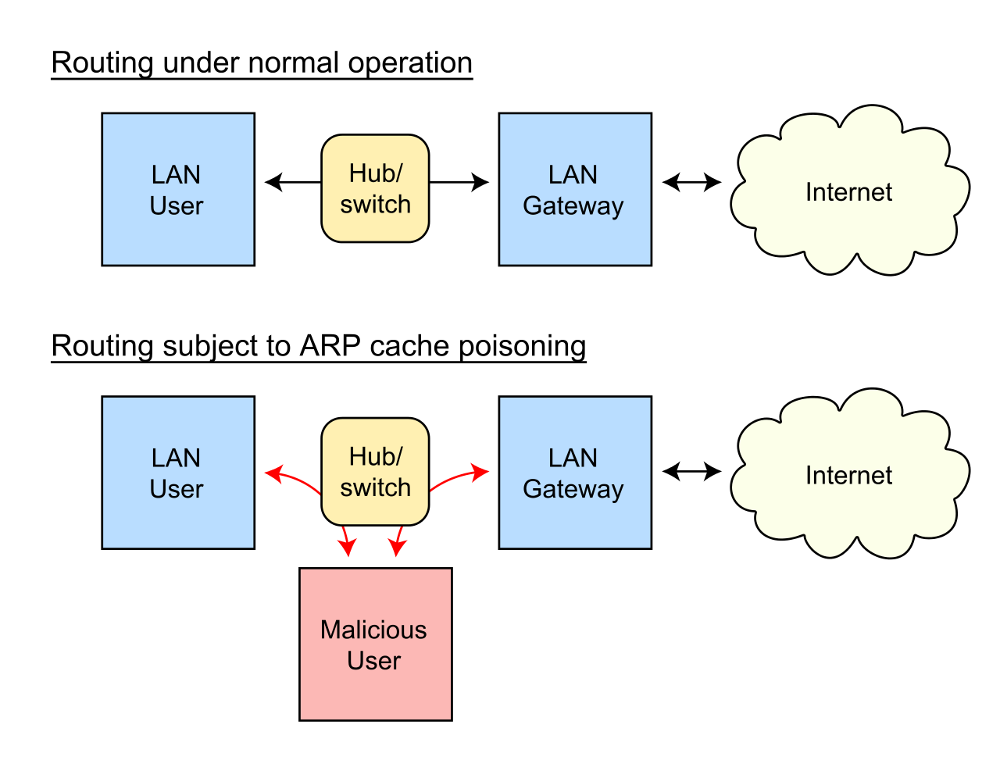

# 1.0 Threats, Attacks, and Vulnerabilities

## 1.1 Social engineering techniques
- Phishing: sending a fraudulent message (usually by email, telephone, or text message) that is designed to elicit sensitive information from a victim such as usernames, passwords, bank and credit card details or other PII
- Smishing: a phishing attempt over SMS (Short Message Service)
- Vishing: Voice phishing, a phishing attempt over the phone or VoIP (e.g. Skype, Discord, FaceTime, etc.), this could include targeting customer service or cold calling a target directly
- Spam: sending phishing message en masse particularly over email
- SPIM (SPam over Internet Messaging): a phishing attempt over IM (e.g. Facebook chat, Discord, Twitter, etc.)
- Spear phishing: phishing attempts targeted at an individual or small groups 
- Dumpster diving: an attempt to recover sensitive information from discarded documents
- Shoulder surfing: an attacker can observe a target entering sensitive info either directly or if a monitor, keypad, etc. is easily viewable from a distance with binoculars or a telescope
- [Pharming](https://www.malwarebytes.com/pharming): a sophisticated kind of phishing attack that redirects web traffic to a fake site hosted by an attacker to steal usernames, passwords, financial data and other PII. There are two types of pharming:
    1. Pharming malware / DNS changers: infects a target's computer and modifies the `hosts` file
    2. DNS poisoning / DNS spoofing: exploits software that controls DNS servers to reroute web traffic. This is typically targeted at companies that maintain DNS servers.
- Tailgating: entering a locked/secured area without a key/passcode by following close behind someone with a key
- Eliciting information
- Whaling: a phishing attack aimed at high-profile targets such as executives, government officials, etc.
- Prepending: adding code to the beginning of a file that executes when the file is opened
- Identity fraud
- Invoice scams: fake bills usually sent via email

- Credential harvesting: using various methods to steal user credentials
- Reconnaissance
- Hoax
- Impersonation
- [Watering hole attack](https://www.malwarebytes.com/watering-hole-attack): a cyberattack targeting groups of users by infecting/compromising commonly visited websites
- Typo squatting: hosting a fake/copied website on a similarly spelled domain to collect credentials, PII, etc. Attackers often use other languages to replace characters in a common domain name, such that the URL will still appear to be correct.
- Influence campaigns
- Social Engineering Principles / reasons for effectiveness
    - Authority
    - Intimidation
    - Consensus
    - Scarcity
    - Familiarity
    - Trust
    - Urgency

## 1.2 Analyzing potential indicators to determine type of attack
- Malware
    - Ransomware: malware that encrypts files on a machine to extract a ransom from a user/company/org
    - Trojans: malware that masquerades as a legitimate program/software
    - Worms: malware that can automatically propogate itself to more devices over a network
- Password attacks
    - Spraying: attempting to access many accounts using a short list of common passwords. This type of attack is usually low-and-slow meaning all the accounts are tried with a single password at a time to avoid account lockouts
    - Dictionary: attempting to login to an account using a list of common passwords (dictionary).
- Physical attacks
    - Malicious USB cable/drives
- Supply-chain attacks
- Cloud-based vs. on premises attacks
    - Cloud requires less staff and cost for maintaining a data center. Cloud providers manage large-scale security allowing for automated security updates and limited downtime. Cloud providers also allow for scalable deployment.
    - On-prem allows you full control to better manage security and uptime/availability, but this comes at an extra cost of equipment and staff to maintain and secure the data center.
- Cryptographic attacks
    - most successful cryptographic attacks target poor implementations of cryptographic algorithms
    - Examples
        1. Hash collisions
        2. Downgrade attack

## 1.3 Analyzing potential indicators of application attacks
- Privilege escalation
- [XSS](https://portswigger.net/web-security/cross-site-scripting): a web security vulnerability that circumvents the _same origin_ policy to compromise a user's application access and data
- Injections attacks: 
    - [SQL injection](https://portswigger.net/web-security/sql-injection)
    - NoSQL
    - XML
    - HTML/JS
- [Buffer overflows](https://owasp.org/www-community/vulnerabilities/Buffer_Overflow): when a program attempts to write more data than a buffer has been allocated.
- Replay attacks: pass the hash, session cookies, session id
- Request forgery attacks: 
    - [CSRF](https://portswigger.net/web-security/csrf): the attacker induces a user to perform unintentional actions such as changing their password, transferring funds, etc.
    - [SSRF](https://portswigger.net/web-security/ssrf): the attacker induces a server-side application to make HTTP requests to an arbitrary domain, possibly allowing them to access internal services of an organization, or exfiltrate data
- Refactoring: malware that changes itself every time it's downloaded to avoid signature detection. For example:
    - adding NOPs
    - adding loops
    - adding pointless code strings
    - reordering functions
- Driver manipulation
    - [Shimming](https://attack.mitre.org/techniques/T1546/011/): running windows application with windows compatibility mode to bypass security like UAC
    - Refactoring: this is in reference to _metamorphic malware_ which changes each time it's downloaded to bypass AV
- SSL stripping / HTTP downgrade: when an attackers man-in-the-middles (proxy server, ARP spoofing, rogue Wi-Fi hotspot etc.) and modifies the data to downgrade to HTTP or an older version of SSL/TLS
    - SSL 2.0 deprecated in 2011
    - SSL 3.0 deprecated in 2015
- Race conditions
    - [TOCTOU (Time-Of-Check to Time-Of-Use)](https://en.wikipedia.org/wiki/Time-of-check_to_time-of-use) attack: a class of software bugs caused by a race condition
- Memory vulnerabilities
    - Memory leak: unused memory is not properly released leading to reduced system performance or crash
    - Null pointer dereference
    - Integer overflow
- Directory traversal
- Error handling
- Improper input handling
- API attacks: the malicious use of an API endpoint to access and exploit data, some examples include:
    - MITM/On-path/Session-High-Jacking: an attacker intercepts authentication credentials in the API request
    - SSL protocol downgrade
    - SQL injection
- Resource exhaustion
    - ZIP bomb
    - DHCP starvation: at attack floods the network with IP address requests, and the DHCP server eventually runs out of addresses

## 1.4 Analyzing potential indicators of network attacks
- Wireless
    - Rogue access point: an unauthorized wireless access point can be used as a potential backdoor even if it isn't malicious
    - Evil twin: an access point configured to look like an existing network with the same or similar SSID and security settings. May be used to _overpower_ the existing access points depending on location and transmission strength.
    - [Bluejacking](https://nordvpn.com/blog/bluejacking/): sending unauthorized messages to devices via Bluetooth
    - [Bluebugging](https://nordvpn.com/blog/bluebugging/): an attack over bluetooth than grants an attacker complete control of the device
    - [Blusnarfing](https://nordvpn.com/blog/bluesnarfing/): exploiting Bluetooth connections on a Bluetooth-enabled device to transfer data (contact list, email, pictures, etc.), modern devices with updated Bluetooth are not susceptible.
    - Disassociation/[deauthentication](https://en.wikipedia.org/wiki/Wi-Fi_deauthentication_attack) attack: 802.11 wireless requires management frames which can be spoofed by an attacker to tell an access point to deauthenticate your client, thus forcing your credentials to be resent to be captured by the attacker. IEEE 802.11w protects against this attack.
    - RF Jamming: transmit interfering wireless signals to decrease the signal-to-noise ratio at a receiving device
    - RFID: commonly used as ID cards, usually powered by source of the signal, but some units use batteries to allow bi-directional communication between the RFID chip and the reader.
    - [NFC (Near Field Communication)](https://en.wikipedia.org/wiki/Near-field_communication): commonly used for wireless payment systems and to bootstrap Bluetooth pairing
- Cryptography without randomization: encrypted data can often _look_ similar to the original data without randomization
    - Cryptographic nonce: an arbitrary number used once 
    - IV (Initialization Vector): a type of nonce to add randomization to an encryption scheme
    - Salt: a nonce usually used for stored password hash randomization
- On-path / Man in the middle: an attacker intercepting and possibly modifying network traffic before redirecting the traffic to its original destination
- [On-path browser / Man in the browser attack](https://owasp.org/www-community/attacks/Man-in-the-browser_attack): the user of Trojan to intercept and manipulate calls between a browser and its security libraries on the fly
- Layer 2 attacks
    - [ARP Poisoning](https://en.wikipedia.org/wiki/ARP_spoofing): on-path attack on the local IP subnet. ARP has no security.
    
    - [MAC flooding](https://en.wikipedia.org/wiki/MAC_flooding): a switch has as limited space to store its MAC table, attackers can send traffic to the switch with different source MAC addresses to force out the legitimate MAC addresses
        - once the MAC table is full the switch will begin sending traffic to all output interfaces essentially turning the switch into a hub, this allows attackers to easily capture all the network traffic transmitted on the network
        - most switches have settings to mitigate this attack
    - [MAC cloning / spoofing](https://en.wikipedia.org/wiki/MAC_spoofing): when an attacker changes their MAC address to match the MAC address of an existing device
- DNS (Domain Name System)
    - DNS poisoning: 
        - modifying a client's host file
        - modifying the DNS server
        - on path attack sending fake responses to DNS requests
    - [Domain hijacking](https://en.wikipedia.org/wiki/Domain_hijacking): when an attacker takes control of a domain's registration
    - URL hijacking / redirection: e.g. `.net`, `.io`, `.us` instead of `.com` or vice versa or simple domain name misspellings
    - Domain reputation: e.g. spam email sent out from a domain can give a domain a bad reputation and cause email/service providers to drop or reject email from these servers, similarly web servers infected with malware may be flagged or blocked
- [DoS (Denial of Service)](https://en.wikipedia.org/wiki/Denial-of-service_attack) / [DDoS (Distributed Denial of Service)](https://en.wikipedia.org/wiki/Denial-of-service_attack#Distributed_DoS_attack)
    - forcing a server to fail / overload
    - causing systems to be unavailable for a competitive advantage
    - Unintentional DoS
    - Network DoS, layer 2 loop without STP
    - Bandwidth DoS, not enough bandwidth available
    - Physical: power off, water line break, electrical failures etc.
    - DDoS amplification: sending queries to services that respond with large amounts of data relative to the query. This can be done with protocols such as DNS, NTP, and ICMP.
    - Application DoS
        - Increasing downtime/cost by making an application break or struggle under load
        - Fill disk space e.g. Zipbomb
        - Overuse cloud resources CPU, memory, network capacity etc.
    - OT (Operation Tech) DoS: think traffic control, chemical/manufacturing plants, electrical grids and other ICS systems.
        - Requires more critical security posture compared to IT
- Malicious code or script execution
    - Bash/shell script
    - Python
    - Powershell
    - File macros (.xlsx, .docx, .ppt) / VBA

## 1.5 Threat actors, vectors, and intelligence sources
- Threat actors and attributes of attackers
    - Insiders: have institutional knowledge even if the attacks are less sophisticated
    - Nation states: governments along with all their resources
    - APT (Advanced Persistent Threat)
    - Hacktivist: politically motivated, not usually well-funded
    - Script kiddie: an attacker running pre-made scripts without in-depth knowledge
    - Organized Crime: motivated by money, can be very sophisticated (the best hacking money can buy)
    - Shadow IT: going rogue without interacting with the IT department/procedures
    - Competitors: e.g.  DoS, espionage, damaging reputation
- Attack Vectors: method  used by an attacker to gain access/infect a target
    - Direct access:
        - physical access
        - keylogger
    - Wireless:
        - default creds
        - rogue access points
        - evil twin
    - Email: phishing or other social engineering attempts
    - Supply chain: each piece of the underlying infrastructure is a potential attack vector
        - vendors and contractors, e.g. Stuxnet, Colonial Pipeline
    - Social media: user profiling, PII, vacation pictures etc.
    - USB devices: air gapped systems, ICS, high security systems
    - Cloud: public facing applications/services, security misconfigurations, DoS
- Threat intelligence sources
    - OSINT
    - Proprietary intelligence
    - Vulnerability databases: CVE, NVD, etc
    - AIS (Automated Indicator Sharing): a 
        - [STIX (Structured Threat Information eXpression)](https://oasis-open.github.io/cti-documentation/stix/intro.html): standard format to share important threat data
        - [TAXII (Trusted Automated  eXchange of Indicator Information)](https://oasis-open.github.io/cti-documentation/taxii/intro.html): protocol for securely sharing STIX data
    - Dark web intelligence: TTPs of hacker groups, credit card sales, accounts, passwords etc. Monitor these forums for 'company names' and 'executive names' 
    - IOC (Indicator Of Compromise): specific activity indicating intrusion. E.g.: unusual network activity, file hash values, DNS changes, uncommon login patterns, etc.
    - Predictive analysis: analyzing large amount of data and searching for suspicious patterns (DNS queries, location data/international, unusual traffic patterns). Attempt to forecast future attacks. Often combined with ML.
    - Threat maps
    - File/code repositories: GitHub, GitLab. Attackers will watch targets for misconfigured repos with public access
- Threat Research
    - Vendor websites / publicly available documentation
    - [NVD (National Vulnerability Database)](https://nvd.nist.gov/): US government repo of vulnerability management data
    - [CVE (Common Vulnerabilities and Exposures)](https://www.cve.org/): catalog of publicly disclosed vulnerabilities
    - [CVSS (Common Vulnerability Scoring System)](https://nvd.nist.gov/vuln-metrics/cvss/v3-calculator): a open framework for communicating the severity and characteristics of vulnerabilities
    - Conferences: research, talks, latest tech, stories from the trenches, PoCs, etc.
    - Academic journals: cutting edge research, detailed post mortems, modern attack methods
    - RFC (Request for Comments): formalized standards
    - Local user and industry groups
    - Social media: e.g. hacking group conversations, honeypot monitoring on Twitter, security researchers' analysis of vulnerabilities
    - Threat feeds: e.g. DHS, FBI, SANS Internet Storm center, VirusTotal Intelligence etc.
    - TTPs (Tactics, Techniques, Procedures) used by attackers: [MITRE ATT&CK](https://attack.mitre.org/)

## 1.6 Explain security concerns associated with various types of vulnerabilities
- 0-day (Zero-day) attacks
- Weak configurations
    - open permissions / firewalls on the open Internet: increasingly common with cloud infrastructure
    - Unsecured root accounts / weak password
    - Errors / Error messages: may show service, version, or debug info etc.
    - Weak encryption: 
        - length of encryption keys
        - appropriate protocols / standards: e.g. AES, 3DES, etc.
        - integrity checks via SHA, MD5 etc.
        - follow best practices
    - Insecure protocols: e.g. telnet, FTP, SMTP etc.
    - Open ports and services: always test and audit your firewalls
- Improper patch management: e.g. BIOS/firmware updates, OS updates
- Legacy platforms/devices: older operating systems, application etc.
- 3rd-party risks: always prepare for a breach
    - System integrators: may require elevated OS access / on-site (may have physical access) or off-site
    - Lack of vendor support: vendor must be notified of problems, remediation may not be quick or comprehensive
    - Supply chain risks: hardware and software from a vendor may contain malware. Also consider the potential of counterfeit hardware
    - Outsourced code development: developer access, internal or over VPN? cloud-based? all questions to be considered
    - Data storage: entire data flow may need to be encrypted, limit exposure
- Vulnerability Impacts
    - Data loss
    - Reputation impact: Uber breach October 2016
    - Availability loss

## 1.7 Summarize the techniques used in security assessments
- Threat hunting: finding the attacker before they find you / preventive measures
- Vulnerability scans
- SIEM (Syslog/Security Information and Event Management)
    Most SIEMs have the following capabilities
    - Log collectors: storing logs from various data sources in a searcable database
    - Log aggregation: combining dissimilar log formats into a single format
    - Correlation engine: a software component that analyzes and detects patterns in of potential security events in the logs and raises alerts
    - Reports: Exports capabilities usually by categories such as network traffic, logon/logoff events, specific law compliance, and custom templates
    - Packet captures: protocol analyzers able to view and analyze individual packets
    - UBA (User Behavior Analysis): watches for abnormal user activity patterns that may indicate malicious activity
    - Security monitoring: SIEMs usually have some default alerts such as for port scans and allow for custom alerts
    - Automated triggers: configured thresholds to trigger a response such as updating firewall rules, or run scripts
    - Time synchronization: adjust logs/alert times to/from GMT for consistency during investigations
    - Event deduplication: removing duplicate entries such as the same email sent to multiple users
    - Logs/WORM (Write Once Read Many): a form a write protection to prevent modification of log entries
- SOAR (Security Orchestration Automation, Response

## 1.8 Techniques used in pen testing
- Penetration testing
    - always define scope / Rules of Engagement, schedule, IP ranges, emergency contacts etc.
    - Known vs unknown (blind) environment tests
    - BE CAREFUL! exploiting vulnerabilities during a pen test could lead to DoS, data loss, or systems instability
    - Aftermath: make sure to cleanup, remove backdoors, binaries, created accounts, and other temp files etc.
    - Reconnaissance
        - Active
        - Passive
- Security teams
    - Red team: attackers
    - Blue team: defenders / operational security , threat hunting, DFIR
    - Purple team: mixture of red and blue team
    - White team: arbiters, manage interactions between blue and red team, enforce rules and resolve issues
