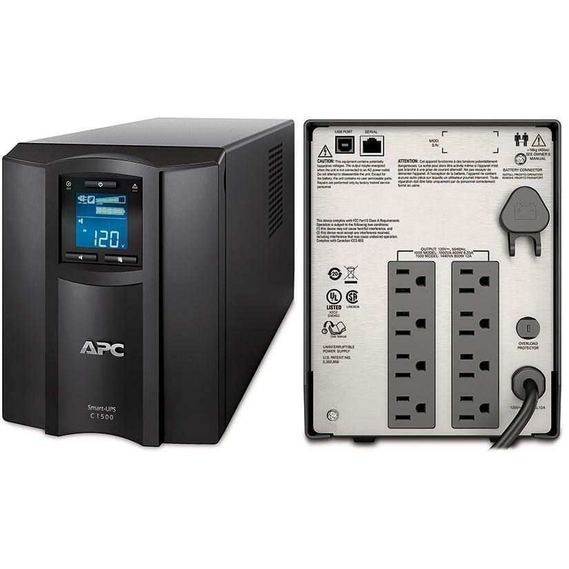

# 2.0 Architecture and Design

## 2.1 Importance of security concepts in an enterprise environment
- Configuration management
    - operating systems, patches, application updates, network modifications etc.
    - identify and document hardware and software settings and re-evaluate security when changes occur
    - Network diagrams
    - Physical data center layout / rack locations
    - Device diagrams / cabling
    - Baseline configurations:
        - applications instances
        - firewalls
        - OS versions
    - Standardized naming conventions for devices (switches, routers, PCs), cables, ports, domain names, email addresses etc.
    - IP schema:
        - consistent addressing for network devices to avoid duplicate IPs
        - IP ranges: different sites have different subnets e.g. 10.1.x.x/24, 10.2.x.x/24 etc.
        - Locations: subnets / hosts per subnet
        - Reserved addresses: e.g. x.x.x.1 default gateway or other devices
- Data protection
    - Data masking
        - Data obfuscation to protect PII and other sensitive data. E.g. obfuscated credit card numbers, emails , etc.
    - Data encryption
        - _Confusion_: ensuring the encrypted data is drastically different from the original plaintext
        - _Diffusion_: when changing one character of the input, the output data is dramatically different
    - Data sovereignty: data that resides in a country is subject to the laws of that country
        - GDPR (General Data Protection Regulation)
    - [Data at-rest](https://en.wikipedia.org/wiki/Data_at_rest): data on a storage device like: HDD, SSD, flash drive, etc. This data may require _full_ disk encryption, database encryption, or directory-level encryption and user permissions using ACLs
    - [Data in-transit/in-motion](https://en.wikipedia.org/wiki/Data_in_transit): data on a network via routers, switches and other devices
    - [Data in-use](https://en.wikipedia.org/wiki/Data_in_use): RAM, cache, CPU registers
    - [Tokenization](https://en.wikipedia.org/wiki/Tokenization_(data_security)): storing derived "tokens" in place of sensitive data such as credit card numbers, PII, etc. while still maintaining an association with a user's account/information
    - [IRM (Information Rights Management)](https://www.mcafee.com/enterprise/en-us/security-awareness/cybersecurity/what-is-information-rights-management-irm.html): can be applied  to files like emails, documents, PDFs to restrict editing, prevent copy+paste, etc.
    - [DLP (Data Loss Prevention)](https://en.wikipedia.org/wiki/Data_loss_prevention_software)
        - Endpoint based (Data in-use) solutions
        - Network based (Data in-motion) solutions
        - Server based (Data at-rest) solutions
        - Cloud based
        - Email based: checking inbound and outboud messges, blocking/quarantining keywords, attached files, etc.
        - Can block hardware such as allowing/disallowing actions by a USB flash drive
- [HSM (Hardware Security Module)](https://en.wikipedia.org/wiki/Hardware_security_module): a physical device that securely manages digital keys and performs encryption/decryption functions to create and authenticate digital signatures, they commonly connect via PCI or USB
- [CASB (Cloud Access Security Broker)](https://www.mcafee.com/enterprise/en-us/security-awareness/cloud/what-is-a-casb.html)
- Geographical considerations
    - Legal implications: regulations between states and other countries. Must consider for recovery sites in other countries, personnel must have a passport and be cleared for immigration etc. What time of access does the 3rd party have over your data?
- Response and recovery controls
    - Incident response should involve:
        - Documenting the process from beginning to end
        - Identify the attackc
        - Contain/mitigate the attack
        - Limit data exfiltration and access to other sensitive information
- SSL/TLS inspection
- Hashing: MD5, SHA-1, SHA-256, etc.
- API considerations
    - it is important to secure and harden APIs as well as normal user logins
    - On-path attack: intercept and modifying API messages may make a _replay_ attack possible
    - API Injection: injecting data into an API message to steal data, DoS, etc.
    - Authentication: use secure protocols and limit API access to legitimate users
- Honeypots and Deceptions
    - Honeypots examples: Kippo, Google Hack Honeypot, Wordpot
    - Honeynets: network of honeypots, `https://projecthoneypot.org`
    - Honeyfiles: bait in a honeypot  e.g. `passwords.txt`. Alerts are sent when honeyfiles are accessed.
    - DNS sinkhole: a DNS that hands out incorrect  IP addresses
        - can be used by an attacker to redirect users to a malicious site
        - Also used by blue team to redirect known malicious domains to a benign IP address, and report any infected hosts

## 2.2 Virtualization and cloud computing concepts
- Cloud models
    - IaaS (Infrastructure as a Service) / Haas (Hardware as a Service)
        - outsourced equipment/hardware, still manage OS and software/services, security etc.
    - SaaS (Software as a service) - no local installation, 3rd party handles all the OS configuration, applications, maintenance, and data.
    - [PaaS (Platform as a Service)](https://www.ibm.com/cloud/learn/paas): platform provided to develop applications, no servers, no software. You handle development.
        - ususally hosted by 3rd party so you don't have direct control of data or infrastructure
        - E.g. SalesForce.com
    - [XaaS (Anything as a Service)](https://www.geeksforgeeks.org/overview-of-everything-as-a-service-xaas/): broad description of cloud models using any combination of the cloud
        - flexible consumption model with less upfront costs
- Cloud service providers
- MSP (Managed Service Provider) / MSSP (Managed Security Service Provider)
    - Provide support: network connectivity management, backups, disaster recovery, growth planning etc.
    - MSSPs may also provide: firewall management, patch management, security audits, and emergency response
- On-prem vs off-prem
- Cloud deployment models
    - Public: available on the open Internet
    - Community: shared resources between multiple organizations
    - Private: internal to an organization's data center
    - Hybrid: Mixture of the above models
- Edge computing: computing done on the locally and doesn't to access the Internet
    - IoT/IIoT
- Fog computing: Cloud + IoT
    - A cloud that's close to your data
    - Acts as a layer between your IoT devices to handle processing of _some_ not all of the data before sending it to other IoT devices or further up the cloud infrastructure for more processing.
- Thin client
    - [VDI (Virtual Desktop Infrastructure)](https://azure.microsoft.com/en-us/overview/what-is-virtual-desktop-infrastructure-vdi/#what-is-vdi) / DaaS (Desktop as a Service)
- Containers
- Micro-services/API
- Infrastructure as code: defining servers, networks, and application instances. This makes modifying the infrastructure as easy as versioning normal application code
    - [SDN (Software-Defined Networking)](https://www.ibm.com/cloud/blog/software-defined-networking)
- Serverless architecture
    - [FaaS (Function as a Service)](https://www.cloudflare.com/learning/serverless/glossary/function-as-a-service-faas/): applications are separated into individual functions and removes the OS
    - Functions run in a stateless compute container
    - This allows compute containers to be added as needed
- Resource policies: assigning permissions to cloud resources available for provisioning by whom
- Services integration / SIAM (Service Integration and Management): a model for multi-sourcing
- [Transit gateway](https://docs.aws.amazon.com/vpc/latest/tgw/what-is-transit-gateway.html): routes traffic in an organization's VPC (Virtual Private Cloud)
- Virtualization
    - VM sprawl avoidance: with VMs it is very easy to get carried away and build unnecessary/interrelated instances and not be aware of which application are run on which VMs. This makes it difficult to deprovision resources.
    - have a detailed process for provisioning, tracking resources, and deprovisioning
    - VM escape protection
- [SDV (Software-Defined Visiblity)](https://www.gigamon.com/content/dam/resource-library/english/white-paper/wp-software-defined-visibility-new-paradigm-for-it.pdf):

## 2.3 Secure application development, deployment, and automation
- Sandboxing: an isolated test environment with no connection to the real world / production systems
- Security baselines / environment: the security of an app environment should be well defined including firewall  settings, patch levels, OS versions
- Provisioning and deprovisioning
    - Provisioning: deploying an application instance: web server, database server, middleware server, workstation configurations etc. Also includes security components like operating system and application security updates. Also includes network security like secure VLANs, internal access, external access / VPNs
    - Deprovisioning: dismantling and removing application instances and other resources
        - don't forget you also need to decprovision your security measures, don't leave open holes and don't close important ones. Firewall rules must be reverted and so on.
        - What happens to the data? Have procedures for handling it prior to deprovisioning.
- Integrity measurement
- Secure coding techniques
    - It's a balance between time and quality, testing/QA is of prime importance
    - [Stored procedures](https://database.guide/what-is-a-stored-procedure/): a procedure stored on the database itself preventing malicious modification to DB / SQL queries
    - Obfuscation/camouflage
    - Code reuse: code copy+pasted between applications
    - Dead code: code that is executed but the results are unused or not executed at all
    - Input validation: the application should use normalization and verify inputs at all possible locations of user input
        - Server-side validation: all checks occur on the server
        - Client-side validation: the client makes all the checks, is usually faster but is usually less safe than server-side. Ideally both server and client-side validation will be used.
    - Memory management:  never trust user input, look out for buffer overflows
    - Third-party libraries and SDKs: be aware of vulnerabilities and security of 3rd party libraries
    - Data exposure
        - sensitive data (credit card numbers, social security,  medical info, addresses) should always be encrypted or tokenized, ensure data sent over the network is also encrypted and the data is stored securely, also consider filtering info shown to screen when necessary (obfuscation)
        - whenever data is entering or leaving an application, it should be checked for any exposures
    - Version control: Don't leave credential, api keys, etc. Even if they are private repos it is bad practice.
- Software diversity: using compiler tricks to subtly change the output binary while remaining functionally the same for different builds or instances of the application
- Automation/scripting
    - Automated courses of action
    - Continuous monitoring: e.g. monitor disk space available for logs and automatically handle when threshold is reached
    - Continuous validation: e.g. checks when automatically provisioning and deprovisioning cloud resources
    - [CI (Continuous Integration)](https://aws.amazon.com/devops/continuous-integration/): code is constantly being written and merged to a central repository to run automated tests and builds
        - this offers many opportunites for security problems to arise
    - CD (Continuous Delivery/Deployment): automated testing process and automated release process
- [OWASP](https://owasp.org/) (Open Web Application Security Project)
- Scalability and Elasticity
    - Handle changes in application workload
    - Scalability: the ability to increase the workload in a given infrastructure
    - Elasticity: The ability to increase or decrease available resources as the workload changes

## 2.4 Authentication and authorization design
- Authentication methods
    - Directory services: keep usernames and passwords in a single database for workstations, printers, and other devices. Think MS Active Directory via Kerberos or LDAP
    - Federation: providing network access to others such as partners, suppliers, customers etc. Can provide SSO too
    - Attestation: proof that hardware connecting over the network is trusted
        - Remote attestation: automated reporting to a verification server using TPM or an IMEI
    - Technologies
        - [SMS (Short Message Service)](https://en.wikipedia.org/wiki/SMS): text messages etc.
        - [RCS (Rich Communication Service)](https://en.wikipedia.org/wiki/Rich_Communication_Services): a communication protocol between mobile phone carriers and mobile phones, with the goal to replace SMS
        - Push notification: notification 'pushed' to a particular app
            - be aware some push notifications send in the clear
        - Authentication apps: use pseudo-random token generators e.g. SteamGuard / Authy
        - [TOTP (Time-base One-Time Password)](https://www.twilio.com/docs/glossary/totp)
        - [HOTP (HMAC-based One-Time Password)](https://en.wikipedia.org/wiki/HMAC-based_one-time_password)
        - Phone call: another common vector for 2FA, similar disadvantages as SMS such as being intercepted or forwarded by a third party
        - Static code: e.g. PIN, password, passphrase
        - Smart Card: may be integrated or RFID/contactless, the card usually uses a digital certificate
- Biometrics (something you _are_)
    - Fingerprints, 
    - Eyes: retinas (unique capillary structure), irises (texture, color)
    - Voice recognition
    - Facial recognition
    - Gait analysis
    - Vascular scanners
    - FAR (False Acceptance Rate): be careful to calibrate the sensitivity of biometric scanners
    - FRR (False Rejection Rate): be careful to calibrate so users are not needlessly rejected
    - CER (Crossover Error Rate): a balance between FAR and FRR such that the overall accuracy is acceptable for both acceptance and rejection rates
- [MFA (Multifactor Authentication)](https://www.cisa.gov/sites/default/files/publications/NCSAM_MFAGuide_2020.pdf) factors and attributes
    - Factors:
        1. Something you _know_
        2. Something you _have_
        3. Something you _are_
    - Attributes:
        1. _Somewhere_ you _are_
        2. _Something_ you _can do_
        3. _Something_ you _exhibit_
        4. _Someone_ you _know_
- AAA (Authentication, Authorization, and Accounting)
    - Authentication = Identification: prove you are who you say you are
    - Authentication = what resources should you have access to?
    - Accounting = resources used: login time, data sent and received, logout time
- Cloud vs. on-prem authentication

## 2.5 Implement cybersecurity resilience
- Redundancy
    - duplicate parts of the system in case of failure to maintain uptime
    - Be aware of possible hardware or software failures and have procedures prepared to maintain uptime and availability
    - Geographic dispersal: having tech dispersed among geographies can avoid downtime from local damage (e.g. hurricanes, tornadoes, flooding, etc.)
    - Disks
        - Multipath I/O: providing multiple network links for network storage (e.g. using multiple switches available to handle traffic)
            - one solution is using a SAN (Storage Area Network)
        - RAID (Redundant Array of Independent Disks)
    - Networks
        - Load balancing
        - [NIC teaming](https://www.serverwatch.com/guides/nic-teaming/) (LBFO: Load Balancing / Fail Over): providing network redundancy by using multiple NICs on a device
            - this allows for aggregating bandwidth to increase throughput and redundant network paths
            - in software the network cards are bound to appear as a single NIC
            - the switch may also need to be configured to use NIC teaming
            - The NICs in the NIC teaming configuration will multicast to each other and fail over in event of a failed NIC
    - Power
        - UPS (Uninterruptible Power Supply)
        
        - Generators
        - Dual-power supplies: PC with multiple power supplies
        - [PDU (Power Distribution Unit)](https://www.dpstele.com/power-distribution-unit/what-is-pdu.php): a device used in data centers to control and distribute electric power
        
    - Site redundancy/resiliency
        - Recovery site should be prepped, with all data synchronized
        - Recovery may take hours, weeks, or longer
        - Don't forget about procedures for moving operations back to original site after recovery
        - Hot site: an exact replica of production, hardware, software, everything. Requires processes to manage synchronization from production to the hot site.
        - Cold Site: No hardware, no software, no data, you must transfer all necessary hardware and personnel to the cold site to startup.
        - Warm site: somewhere between cold and hot site.
- Replication
    - [SAN (Storage Area Network)](https://www.ibm.com/topics/storage-area-network): high-performance storage network with built-in redundancy
    - VM replication: maintain a single VM instance and replicate to all others to maintain consistency
- On-prem vs. cloud
- Backup types
    - File backups: All MS Windows files have an archive attribute
    - Full: a backup of all files, a full backup must be taken before an incremental or differential backup can be taken
    - [Incremental](https://en.wikipedia.org/wiki/Incremental_backup): all files changed since the last incremental backup
    - [Differential](https://en.wikipedia.org/wiki/Differential_backup): all files changed since the last full backup
    - [Snapshot](https://en.wikipedia.org/wiki/Snapshot_(computer_storage)): mostly metadata that defines the state of the data on a machine, it's not a complete image of the system 
    - NAS (Network Attached Storage) vs SAN (Storage Area Network)
        - NAS only provides file-level access (must rewrite by file)
        - SAN provides block-level access which can be more efficient since you don't need to rewrite entire files that are large
        - both methods require a large amount of bandwidth
    - Cloud backups
    - Image: an exact duplicate of a file system
- Backup media
    - Magnetic tape: easy to store and ship without risk of damage
    - Disk: faster than magnetic tapes and can be used with deduplication and compression
- Non-persistence: describes the cloud environment where services and devices are constantly being added and removed
    - use snapshots to capture versions of the data and configuration separately so they can be rolled back independently
- [HA (High Availability)](https://en.wikipedia.org/wiki/High_availability): always on, always available to preserve maximum uptime
    - of course this always means higher costs
- Restoration order: be aware of dependencies and priorities for each system when restoring from failure/backups
- Diversity: having a diverse IT environment can provide resiliency to systems and security

## 2.6 Explain the security implications of embedded and specialized systems
- Embedded systems
    - SoC (System on a Chip): multiple components running on a single chip e.g. Raspberry Pi
    - [FPGA (Field Programmable Gate Array)](https://en.wikipedia.org/wiki/Field-programmable_gate_array): an IC that allows reprogramming
        - FPGAs are common in routers and used in firewall logic
- SCADA (System Control And Data Acquisition) / ICS (Industrial Control Systems): commonly used in facilities, industrial, manufacturing, energy, logistics
- IoT (Internet of Things): e.g. heating/cooling sensors, home automation, video doorbells, watches, lighting
- Specialized: e.g. medical devices (like heart monitors and insulin pumps), vehicles, aircraft, and smart electric meters
- [POTS (Plain Old Telephone Service)](https://en.wikipedia.org/wiki/Plain_old_telephone_service):
- [PBX (Private Branch Exchange)](https://en.wikipedia.org/wiki/Business_telephone_system#Private_branch_exchange): a telephone exchange or switching system that servers a private organization
- VoIP (Voice over IP)
    - [VoIP Gateway](https://en.wikipedia.org/wiki/VoIP_gateway)
- HVAC (Heating, Ventilation, Air Conditioning)
- Drones / AVs
- MFP (Multifunction printer): e.g printers, scanners, fax machines
- [RTOS (Real-Time Operating System)](https://www.geeksforgeeks.org/real-time-operating-system-rtos/)
- Surveillance systems
- Communication considerations
    - 5G / Cell network
        - SIM (Subscriber Identity Module) card
        - IMSI (International Mobile Subscriber Identity)
    - Narrowband: using a narrow range of frequencies for communications
    - Baseband: usually a single cable with a digital signal (fiber or copper most commonly)
        - the signal uses all the bandwidth
        - e.g. Ethernet 100BASE-TX, 1000BASE-T, 10GBASE-T
        - Zigbee: an IEEE 802.15.4 PAN standard of communication. It's an alternative to WiFi and Bluetooth and allows creation of a mesh network
            - Communicates over the ISM (Industrial, Scientific, and Medical band at 900 MHz and 2.4 GHz

## 2.7 Explain the importance of physical security controls
- Bollards/barricades
- Mantraps
- Badges
- Alarms
- Signage
- Cameras
    - Motion recognition
    - Object detection
- CCTV (Close-Circuit Television)
- Industrial camouflage
- Personnel
    - Guards
    - Robot sentries
    - Reception
    - Two-person integrity/control: ensuring no single person has access to a physical asset
- Locks
    - Biometrics
    - Lock & key
    - Deadbolt
    - Electronic
    - Token-based: RFID badge, magnetic swipe card
    - Cable locks: useful for mobile temporary security
- USB data blocker: allows voltage, but rejects data over USB
- Lighting
- Fencing
- Fire suppression
    - Detection: smoke detector, flame detector, or heat detector
    - Suppression: with water when appropriate otherwise use chemicals like Dupont FM-200
        - Remove the heat: easiest with water or other chemical agents
        - Remove the oxygen: such as displacement with CO2; common for fighting electrical fires
        - Remove the fuel
        - Disrupt the chain reaction: for some chemical reactions
- Sensors: e.g. motion detection, noise detection, proximity reader, moisture detection or temperature sensors
- Drones/UAV
- Visitor logs
- Faraday cages
- [Screened subnet / DMZ (Demilitarized Zone)](https://en.wikipedia.org/wiki/Screened_subnet): 
- PDS (Protected Distribution System): used to physically secure cable networks
- Secure areas
    - Air gaps: a physical separation between networks
    - Vault: a secure reinforced room to store backup media and protect from disaster or theft
    - Safe: equivalent to a vault on a smaller scale and is less expensive providing less space
    - Hot and cold aisles
    
- Secure data destruction
    - Burning
    - Shredding
    - Pulping
    - Pulverizing
    - [Degaussing](https://en.wikipedia.org/wiki/Degaussing#Magnetic_data_storage_media)
    - Third-party solutions
    - Purging data: removing from an existing data store. E.g. deleting some data from a database
    - Wiping data: unrecoverable removal of data on a storage device, this is useful in the event the storage media needs to be reused

## 2.8 Basics of cryptographic concepts
- [Digital signatures](https://en.wikipedia.org/wiki/Digital_signature): a mathematical scheme for verifying the authenticity of digital messages or documents
- Key length
    - the longer the better in most cases
- Key stretching
    - a method of hashing hashes of passwords repeatedly to make them harder to brute force
    - Libraries: bcrypt, [PBKDF2 (Password-Based Key Derivation Function 2)](https://cryptobook.nakov.com/mac-and-key-derivation/pbkdf2)
- Salting
- Hashes / message digest
- Key exchange
    - Out-of-band key exchange: sending the key via an alternate method (telephone, courier, in-person etc.)
    - In-band key exchange: sending the key over the network
        - a symmmetric key can be protected by using asymmetric encryption on top to securely deliver the symmetric key
- [Elliptical curve cryptography](https://cryptobook.nakov.com/asymmetric-key-ciphers/elliptic-curve-cryptography-ecc)
    - uses smaller keys than non-ECC asymmetric encryption
    - smaller storage and transmission requirements
    - perfect for mobile devices
- [PFS (Perfect Forward Secrecy)](https://nordvpn.com/blog/perfect-forward-secrecy/): instead of using a server's private RSA key to encrypt the data, Elliptic curve or Diffie-Hellman ephemeral algorithms are used such that each session has a new set of public and private keys
    - these keys are made on the fly so they require some additional CPU overhead
- Quantum concerns
- Post-quantum concerns
    - [PQC (Post-Quantum Cryptography)](https://www.nist.gov/programs-projects/post-quantum-cryptography): research related to developing quantum-resistant cryptographic primitives
- Ephemeral keys: using a symmetric key as a temporary session key, it needs to be changed often (every session is the best practice)
- Blockchain: a distributed ledger, everyone on the blockchain network maintains the ledger over a P2P network
- Stream Ciphers: encryption is performed one bit or byte at a time
    - often used with symmetric encryption
    - encrypting a fixed-length block of data (e.g. 64-bit or 128-bit blocks)
- Block Ciphers: encryption is performed per block using block cipher _mode of operation_
    - [Modes of operation](https://en.wikipedia.org/wiki/Block_cipher_mode_of_operation): defines the method of encryption, for example:
        - [ECB (Electronic Codebook)](https://en.wikipedia.org/wiki/Block_cipher_mode_of_operation#Electronic_codebook_(ECB)): the simplest method, each block is encrypted with the same key
        - [CBC (Cipher Block Chaining)](https://en.wikipedia.org/wiki/Block_cipher_mode_of_operation#Cipher_block_chaining_(CBC)): each plaintext block is XORed with the previous ciphertext block, it may also use an initialization vector for the first block
        - [CTR (Counter)](https://en.wikipedia.org/wiki/Block_cipher_mode_of_operation#Counter_(CTR)): uses a counter to add randomization to the algorithm
            1. Encrypt the counter
            2. XOR the encrypted counter with the plaintext
            3. Increment the counter
            4. Repeat steps 1-3 for each block
        - [GCM (Galois/Counter Mode)](https://en.wikipedia.org/wiki/Galois/Counter_Mode): encryption with Galois authentication
- Symmetric vs asymmetric
    - Symmetric: a single, shared key is used for encryption and decryption
        - a secret key / shared secret algorithm
    - Asymmetric: a public and private keys that are mathematically related 
- Lightweight cryptography
    - new standards being created for acceptable levels of security with less CPU/power cost
- Steganography: hiding data within data, this is only a form of obfuscation
- [HE (Homomorphic Encryption)](https://medium.com/privacy-preserving-natural-language-processing/homomorphic-encryption-for-beginners-a-practical-guide-part-1-b8f26d03a98a): allows data to remain encrypted while being processed
    - useful for research on data without viewing it in the clear and less chance for the data to be caught in the clear during the process of encrypting and decrypting the data to process it as you would with normal encryption methods
- Common use cases
    - Low power devices: mobile devices, portable systems: use smaller symmetric keys or ECC
    - Low latency: we want fast computation
    - High resiliency: larger key sizes, better encryption algorithms, hashing to provide data integrity
    - Confidentiality
    - Integrity
    - Obfuscation
    - Authentication
    - [Non-repudiation](https://csrc.nist.gov/glossary/term/Non__Repudiation): confirming the authenticity of data
- Limitations
    - Speed: CPU and power overhead
    - Size: increase in storage depending on data (and its size) being encrypted
    - Weak keys: e.g. WEP has a weak IV (Initialization Vector)
    - Time: encryption and hashing take extra time particularly for large files. Asymmetric is slower than symmetric.
    - Longevity: key sizes must be updated based on improvements in hardware and brute-forcing techniques
    - Predictability and entropy: RNGs are essential for secure cryptography
    - Key reuse
