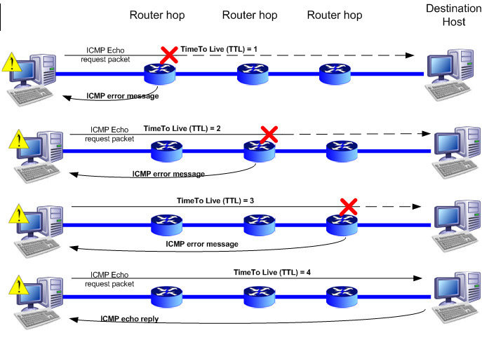
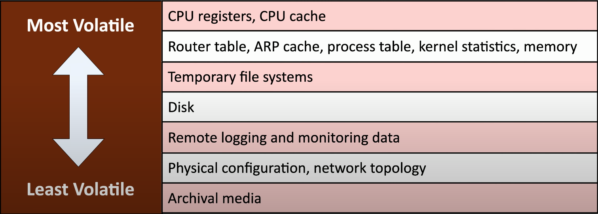

# 4.0 Operations and Incident Response

## 4.1 Use the appropriate tools to assess organizational security
- Network reconnaissance and discovery and OSINT tools
    - [`tracert`](https://docs.microsoft.com/en-us/windows-server/administration/windows-commands/tracert) and [`traceroute`](https://linux.die.net/man/8/traceroute): minor differences between platforms e.g. Windows uses ICMP echo requests which is commonly filtered
     
    - [`nslookup`](https://man.archlinux.org/man/nslookup.1) and [`dig`](https://man.archlinux.org/man/dig.1): lookup information from DNS servers
    - [`ipconfig`](https://docs.microsoft.com/en-us/windows-server/administration/windows-commands/ipconfig) (Windows) and [`ifconfig`](https://man.archlinux.org/man/ifconfig.8): show IP configuration information
    - [`ping`](https://man.archlinux.org/man/ping.8): test reachability
    - [`pathping`](https://docs.microsoft.com/en-us/windows-server/administration/windows-commands/pathping) (Windows): combines ping and traceroute
    - [`netstat`](https://man.archlinux.org/man/netstat.8) and [`ss`](https://man.archlinux.org/man/ss.8): show network connections, routing tables, and interface statistics 
    - [`arp`](https://man.archlinux.org/man/arp.8): manipulate the system ARP cache
    - `route` (Windows) and `netstat -r`: display the kernel routing tables
    - [`route`](https://man.archlinux.org/man/route.8) (Linux): show and manipulate the IP routing table
    - [`curl`](https://man.archlinux.org/man/curl.1) (Client URL): transfer data to or from a server using various protocols
    - [`hping`](https://linux.die.net/man/8/hping3): network tool to send custom TCP/IP packets and display replies from hosts
    - [`nmap`](https://man.archlinux.org/man/nmap.1): network mapper
    - [`theHarvester`](https://www.kali.org/tools/theharvester/): passive recon tool to gather OSINT on a domain
    - [`sn1per`](https://github.com/1N3/Sn1per): attack surface management tool to combine many recon tools into a single framework
    - [`scanless`](https://github.com/vesche/scanless): port scan proxy
    - [`dnsenum`](https://www.kali.org/tools/dnsenum/): perl script to enumerate DNS information of a domain
    - [Nessus](https://docs.tenable.com/nessus/8_13/Content/GettingStarted.htm): popular vulnerability scanner
    - [Cuckoo Sandbox](https://cuckoosandbox.org/): automated malware analysis system and sandbox
- File manipulation tools
    - [`cat`](https://man.archlinux.org/man/cat.1), [`head`](https://man.archlinux.org/man/head.1), [`tail`](https://man.archlinux.org/man/tail.1), [`grep`](https://man.archlinux.org/man/grep.1), [`chmod`](https://man.archlinux.org/man/chmod.1), [`logger`](https://man.archlinux.org/man/logger.1)
- Shell and script environments
    - SSH, PowerShell, Python
- Packet capture and replay
    - [Tcpreplay](https://tcpreplay.appneta.com/): a suite of open source tools for editing and replaying captured network traffic
    - [Tcpdump](https://www.tcpdump.org): a command-line packet analyzer
    - [Wireshark/tshark](https://www.wireshark.org/docs/): a graphical packet analyzer
- Forensics
    - [`dd`](https://man.archlinux.org/man/dd.1): utility for converting and bit-by-bit copying of files, commonly used for creating disk images
    - [`memdump`](https://man.archlinux.org/man/memdump.1): dump system memory to standard output
    - [FTK imager](https://ad-pdf.s3.amazonaws.com/Imager/4_3_0/FTKImager_UG.pdf): a windows forensic drive imaging tool
    - [Autopsy](https://www.autopsy.com/) \([source](https://github.com/sleuthkit/autopsy)\): forensics platform for analyzing mobile devices and digital media
- Exploitation frameworks
    - Metasploit
    - [SET (Social-Engineer Toolkit)](https://github.com/trustedsec/social-engineer-toolkit): a penetration testing framework designed for social engineering
- Password crackers
    - [`john`](https://www.openwall.com/john/doc/), [`hashcat`](https://hashcat.net/hashcat/), [crackstation.net](https://crackstation.net)
- Data sanitization: completely removing data from a drive for future use or permanently deleting a single file
    - This is necessary before disposing of devices and drives

## 4.2 Summarize the importance of policies, processes, and procedures for incident response
- Incident response planning
- Incident response process
    - [NIST SP 800-61](https://nvlpubs.nist.gov/nistpubs/SpecialPublications/NIST.SP.800-61r2.pdf)
    - PICERL
        - Preparation
        - Identification
        - Containment
        - Eradication
        - Recovery
        - Lessons Learned
- Exercises: test yourselves before an actual event, scheduled update sessions (annual, semi-annual etc.)
    - Use well-defined rules of engagement
    - Tabletop exercises: talk through a simulated disaster drill to iron out logistics and procedures beforehand
    - Walkthrough: test the processes and procedures before an event by _walking through_ each step involving all groups and referencing all the actual response materials
- Attack frameworks
    - [MITRE ATT&CK](https://attack.mitre.org/) framework
    - Diamond Model of Intrusion Analysis: [summary](https://www.threatintel.academy/wp-content/uploads/2020/07/diamond_summary.pdf) / [white paper](https://apps.dtic.mil/sti/pdfs/ADA586960.pdf): a model that applies scientific principles to intrusion analysis
    - [Cyber Kill Chain](https://www.sentinelone.com/cybersecurity-101/cyber-kill-chain/)
        - Reconnaissance: gather intel, OSINT, etc.
        - Weaponization: build a deliverable payload that includes an exploit
        - Delivery: send the weapon (e.g. as a phishing attempt via email, SMS, etc.)
        - Exploit: gain code execution using the delivered payload
        - Installation: install malware on the infected host
        - C2: create a C2 channel for remote access
        - Actions on objectives: remotely carry out objectives
- Stakeholder management: include your stakeholders throughout the entire process
- Communication plan
    - get your contact list together and keep it up to date to keep everyone in the loop (e.g. CIO, Internal response teams,  HR, legal department, system owners, law enforcement etc.)
- Disaster recovery plan
- Business continuity plan
- [COOP (Continuity Of Operation Planning)](https://www.fema.gov/pdf/about/org/ncp/coop_brochure.pdf): an effort to ensure mission critical functions continue to be performed in event of emergencies (e.g. natural disasters, accidents, and attack-related emergencies)
- Incident response team: a team that reviews and responds to security incidents
    - [CSIRT (Computer Security Incident Response Team)](https://www.dhs.gov/science-and-technology/csd-csirt): a groups of security experts that assess, document, and respond to a cyber incident
- Retention policies: backup your data, how much data do you have and where is it? Also consider regulatory compliance requirements. Differentiate data by type, application, and priority.

## 4.3 Utilize appropriate data sources to support an investigation
- Vulnerability scan output
    - [National Vulnerability Database](https://nvd.nist.gov/vuln/search)
    - [Windows Security Bulletins](https://docs.microsoft.com/en-us/security-updates/)
    - Watch out for false positives and false negatives, adjust configuration and signatures accordingly
- [SIEM (Security Information and Event Management)](https://en.wikipedia.org/wiki/Security_information_and_event_management): provides security alerts, log aggregation, long-term storage, data correlation, and helps gather details for forensic analysis
    - Sensors and logs: Operating systems, infrastructure devices, NetFlow devices etc. Adjust the sensitivity and categorization as necessary to avoid being overwhelmed with data.
    - Trends and correlation: visualize log data to identify changes over time and attacks
- Log files
    - Network log files: switches router, APs, VPN concentrators etc.
    - Operating system logs
    - Application log files (e.g. Windows Event Viewer, Linux `/var/log/`)
    - Security log files: blocked and allowed traffic flows, DNS sinkhole traffic, IPS logs, firewall logs, etc.
    - Web logs files: web server access, exploit attempts, server activity
    - DNS logs files: lookup requests, known bad domain lookups (malware sites, C2 domains, etc.)
    - Authentication log files: identify brute force attacks and correlate other device authentications
    - Dump files: a memory dump associated with an application
    - VoIP and call manager logs: inbound and outbound call info, authentication logs and audit trail
- Log Management: see [NIST guidelines](https://nvlpubs.nist.gov/nistpubs/Legacy/SP/nistspecialpublication800-92.pdf)
    - [syslog](https://en.wikipedia.org/wiki/Syslog): a standard for message logging
    - Tools/solutions
        - [rsyslog](https://www.rsyslog.com/): a system for fast log processing for Unix-like systems using the syslog protocol
        - [syslog-ng](https://www.syslog-ng.com/): a log management solution for Unix-like systems using the syslog protocol
        - [NXLog](https://nxlog.co/): log collection tool, that also supports log formats for Windows, it can be integrated with most SIEM systems
    - `journalctl`: used to view Linux system logs
    - Log retention policies
- Network monitoring
    - [NetFlow](https://en.wikipedia.org/wiki/NetFlow): a feature of Cisco routers that allows the collection of IP network traffic statistics
    - [sflow](https://sflow.org/sFlowOverview.pdf): a multi-vendor packet sampling technology embedded in switches and routers
    - [IPFIX (Internet Protocol Flow Information Export)](https://en.wikipedia.org/wiki/IP_Flow_Information_Export): an IETF protocol defining a universal standard of IP flow information for routers, switches, probes, etc. It's often used as an alternative to Cisco's proprietary NetFlow.
- Metadata
- Protocol analyzers
    - Wireshark
    - tshark
    - tcpdump

## 4.4 Apply mitigation techniques or controls to secure an environment
- Endpoint security solutions
    - Application approved/deny lists: approve based on certificate, path, network zones etc.
    - Quarantining 
- Configuration changes
    - Firewall rules
    - MDM (Mobile Device Manager): enable/disable mobile device functionality remotely
    - DLP (Data Loss Prevention): block transfer of PII or sensitive data
    - Content/URL filters
- Isolation: 
    - administratively isolate a compromised device to prevent the spread of malware
    - network isolation: isolate to a remediation VLAN
    - process isolation: limit process execution to prevent malicious activity
- Containment
    - Application containment: each application runs in a sandbox with limited interaction to host
- Network segmentation: prevent unauthorized movement between network segments to limit the scope of an breaches
- SOAR (Secure Orchestration, Automation, and Response): uses runbooks and playbooks to automatically respond to malicious activity

## 4.5 Explain the key aspects of digital forensics
- [RFC 3227: Digital forensics best practices](https://datatracker.ietf.org/doc/html/rfc3227)
- Documentation/evidence
    - Legal hold: a legal technique to preserve relevant information
    - Capture video: either of the status of the screen or security camera recordings etc.
    - Admissibility: not all data collected can be used in a court of law
        - data must be collected with the correct tools and procedures
    - [Chain of custody](https://csrc.nist.gov/glossary/term/chain_of_custody): process that tracks the movement of evidence throughout its collection, safeguarding, and analysis lifecycle
        - use hashes during the collection process to identify tampering
        - label and catalog everything
        - document each person who handled the evidence
        - document the date and time it was collected and every time it's transferred
    - Record time offsets
        - e.g. different file systems store timestamps in different formats: fat uses local time and NTFS uses GMT
        - it may be necessary to record any time offsets of the operating system when collecting data
    - Event logs: export and store for future reference (e.g. Windows Event Viewer export or Linux copy `/var/log`)
    - Interviews: what did the users see? Eyewitness accounts won't be 100% accurate but they could give important leads during the investigation.
    - Reports: document all findings for internal use, legal proceedings etc. Provide a summary and detailed explanation of the data acquisition process, findings from the analysis of the data and any conclusions.
- Acquisition
    - Order of volatility: the principle that some data is more volatile than others and should be gathered in the order of most volatile to least, to preserve as much information as possible.
    
    - Disk: 
        - Prepare the drive(s) to be imaged by powering it down to prevent changes and physically removing the disk from the system
        - Then use an imaging device with write-protection to take a complete image (bit-for-bit copy) of each drive
    - RAM: create a memory dump, it may include important information that is never written to disk such as: browsing history, clipboard information, command history, etc.)
    - Swap/pagefile: don't forget to get a copy of the swap when taking a memory dump of the system
    - Operating system: e.g. core operating system files that may have been modified (can be compared to an initial, known-good drive image)
        - other OS data could include: logged in users, open ports, running processes, attached devices, etc.
    - Firmware
    - Snapshot: an image of a VM
    - Cache: temporary storage on the CPU, disk, browser, etc.
    - Network: gather network connections, packet captures to determine OS and application traffic
    - Artifacts: log information, flash memory, prefetch cache files, recycle bin, browser bookmarks etc.
- On-premises vs. cloud
    - The cloud adds complexity to the digital forensics process including technical challenges and legal issues.
    - Right-to-audit clauses: an agreement prior to an incident to allow data sharing between partners, to give you information on where data is being stored, how it's being managed and the security measures in place.
    - Regulatory/jurisdiction: location of data is critical when performing forensics as the legalities can vary widely between countries
    - Data breach notification laws: the laws for data breach notification varies for type of data, how quickly the users must be notified, and geography.
- Managing Evidence
    - Integrity: hash all your data for verification later
        - also maintain documentation of authenticity and chain of custody when handling data
    - Preservation
        - isolate and protect the data
        - work from copies
        - Live collection may be necessary, as some data may be encrypting or impossible to collect after powerdown
    - [E-discovery](https://en.wikipedia.org/wiki/Electronic_discovery): discovery in legal proceedings for litigation, government investigations, etc. for information in an electronic format.
    - [EDRM (Electronic Discovery Reference Model)](https://edrm.net/resources/frameworks-and-standards/edrm-model/): a model of the e-discovery process, following this [diagram](https://edrm.net/wp-content/uploads/2020/04/EDRM-clean-poster-24x36-1.pdf) of the process
    - Data recovery
    - Non-repudiation
    - Strategic intelligence/counterintelligence
