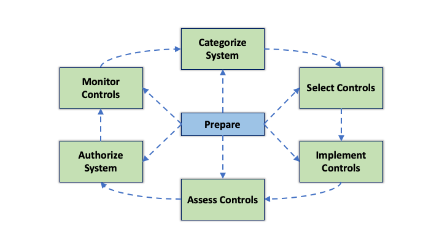
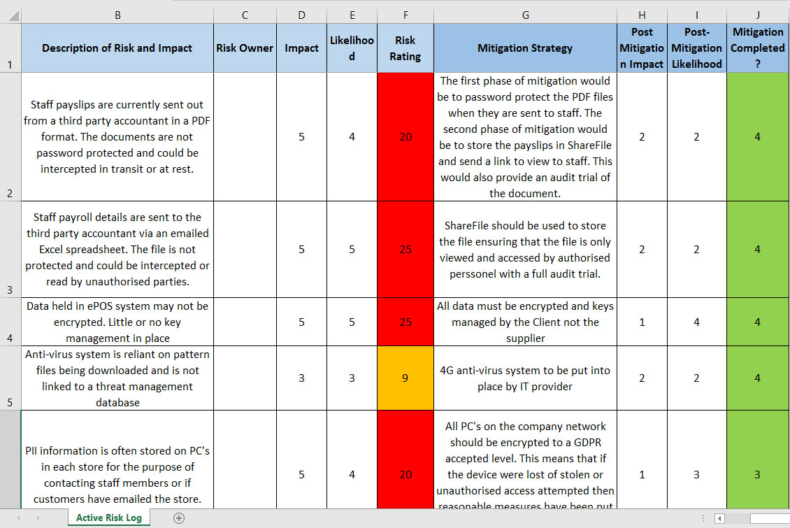
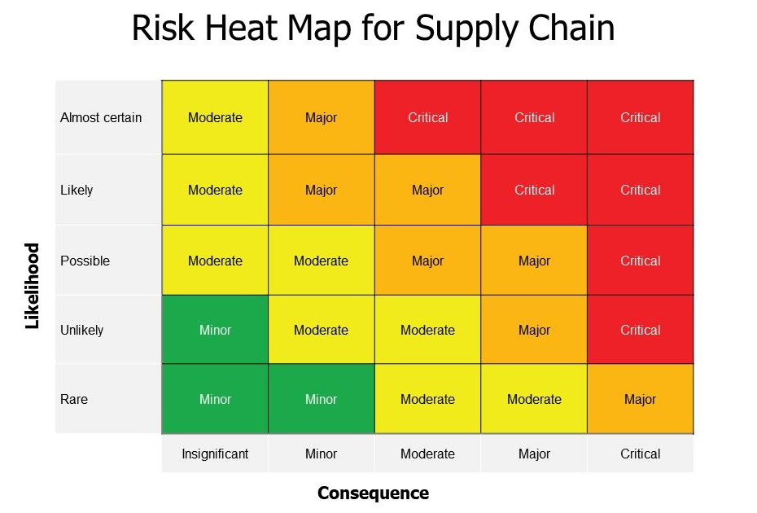
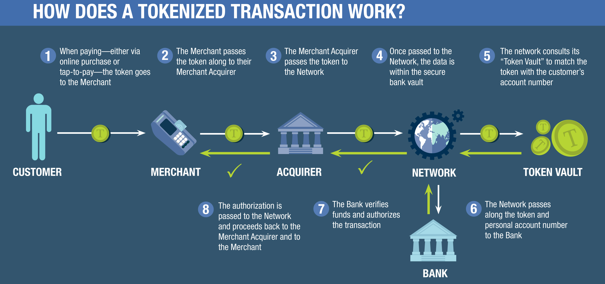
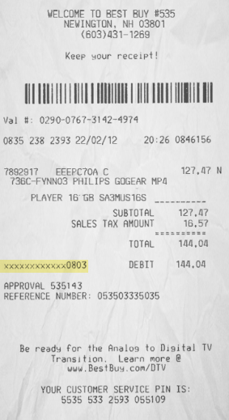

# 5.0 Governance, Risk, and Compliance

## 5.1 Compare and contrast various types of security controls
- Category
    - Managerial/administrative: controls that focus on design and implementation of security such as policies and standard procedures
    - Operational: controls managed by people such as awareness programs and security guards
    - Technical/logical: controls implemented with systems and technology such as OS controls, firewalls, anti-virus, etc.
- Control type
    - Preventative
    - Detective: e.g. IDS
    - Corrective: e.g. IPS, restoring from backups
    - Deterrent
    - Compensating: e.g. backup power systems
    - Physical: door locks, fences, etc.

## 5.2 Explain the importance of applicable regulations, standards, or frameworks that impact organizational security posture
- Regulations, standards, and legislation
    - Compliance: the standards of laws, policies, and regulations
    - Penalties: fines, incarceration, loss of employment etc. if standards are not followed
    - [GDPR (General Data Protection Regulation)](https://en.wikipedia.org/wiki/General_Data_Protection_Regulation): a regulation for data privacy and protection in the EU
    - [PCI DSS (Payment Card Industry Data Security Standard)](https://en.wikipedia.org/wiki/Payment_Card_Industry_Data_Security_Standard)
- Security frameworks
    - [CIS CSC (Center for Internet Security Critical Security Controls)](https://en.wikipedia.org/wiki/The_CIS_Critical_Security_Controls_for_Effective_Cyber_Defense)
    - [NIST RMF (National Institute of Standards and Technology Risk Management Framework)](https://csrc.nist.gov/publications/detail/sp/800-37/rev-2/final): a US federal government standard and process for risk management
    
    - [NIST CSF (National Institute of Standards and Technology CyberSecurity Framework)](https://www.nist.gov/cyberframework/framework): a voluntary commercial framework and set of best practices for mitigating cybersecurity risks
    - [ISO (Internation Organization for Standardization](https://en.wikipedia.org/wiki/International_Organization_for_Standardization) / [IEC (International Electrotechnical Commission)](https://en.wikipedia.org/wiki/International_Electrotechnical_Commission)
        - [ISO/IEC 27001](https://en.wikipedia.org/wiki/ISO/IEC_27001): an international standard on information security mangement
        - [ISO/IEC 27002](https://en.wikipedia.org/wiki/ISO/IEC_27002): best practice recommendations on infosec controls
        - [ISO/IEC 27001](https://en.wikipedia.org/wiki/ISO/IEC_27701): an extension to ISO/IEC 27001 for data privacy specific controls
    - [AICPA (American Institute of Certified Public Accountants)](https://en.wikipedia.org/wiki/American_Institute_of_Certified_Public_Accountants): a national organization in the U.S. that sets ethical and auditing standards
    - [SOC (System and Organization Controls)](https://en.wikipedia.org/wiki/System_and_Organization_Controls):
        - This audit includes firewalls, IDS, MFA, etc.
        - Type I audit: tests the operational effectiveness of controls in place at a particular time
        - Type II audit: tests the operational effectiveness of controls over time (usually 6-12 months).
        - [CSA (Cloud Security Alliance)](https://cloudsecurityalliance.org/)
            - [CCM (Cloud Controls Matrix)](https://cloudsecurityalliance.org/research/cloud-controls-matrix/): a tool for assessment of cloud implementations and guidelines for security controls and compliance applied to cloud environments
- Secure configuration guides
    - Web server hardening: web servers have huge potential for access issues, always apply the appropriate hardening steps from the developers
        - Information leakage: banner info, directory browsing
        - File permissions
        - SSL/HTTPS configuration
    - OS hardening:
        - system updates / service packs and security patches
        - security monitoring
        - network access and security
    - Application server hardening
        - Middleware
        - Disable all unnecessary services
        - OS updates and security patches
    - Network infrastructure devices
        - _ALWAYS_ change default creds
        - Firmware updates and security patches

## 5.3 Explain the importance of policies to organizational security
- Personnel
    - [AUP (Acceptable Use Policies)](https://en.wikipedia.org/wiki/Acceptable_use_policy): documents acceptable use of company assets such as Internet use, mobile devices, computers, etc. This allows the organization to limit legal liability.
    - Job rotation: keeping people moving between responsibilities to reduce the chances for an internal data breach
    - Mandatory vacations: gives time to rotate others through the job and helps to identify fraud, this is more common in high-security environments
    - Separation of duties / splitting knowledge: no one person has all the details
    - Dual control: two people _must_ be present to perform some business function such as opening a vault.
    - Clean desk policy: limit exposure to sensitive data by leaving _nothing_ in/on your desk unattended
    - Least privilege: permissions should be at the bare minimum required for users to do their jobs, don't allow users to run with administrative privileges, this limits the scope of malware compromise
    - Background checks
    - [NDA (Non-Disclosure Agreement)](https://en.wikipedia.org/wiki/Non-disclosure_agreement): a confidentiality agreement and legal contract that prevents dissemination of confidential information
    - On-boarding: signed agreements/documentation, create accounts (user, groups, department assignments), hardware (laptops, mobile devices, tablets, etc.)
    - Off-boarding: pre-planned process to reclaiming devices and data, disabling accounts, etc.
    - User training: 
        - CTFs for blue and red teamers
        - Phishing simulations
        - CBT (Computer-Based Training) videos, game-based, etc.
        - Role-based security awareness training: specialized training by role, or training for third-parties such as contractors, partners, suppliers, etc.
- Third-party risk management
    - Vendors: every organization works with vendors, so it's important to perform a risk assessment for each vendor, enforce secure environment with contracts
        vender diversity: implementing security such as screen subnets for different vendors
    - Supply chain
    - Business partners: much closer than a typical vendor
        - Partner risk management and best practices for handling data and intellectual propery
    - [SLA (Service Level Agreement)](https://blog.hubspot.com/blog/tabid/6307/bid/34212/How-to-Create-a-Service-Level-Agreement-SLA-for-Better-Sales-Marketing-Alignment.aspx): a contract that establishes a minimum set of deliverables, it's designed to set clear expectations to mitigate any issues
    - [MOU (Memorandum Of Understanding)](https://www.investopedia.com/terms/m/mou.asp): an informal agreement between two parties giving a broad outline of the expectations between the two parties
    - [MSA (Measurement Systems Analysis)](https://en.wikipedia.org/wiki/Measurement_system_analysis): evaluation of the process used in their measurement systems to calculate any uncertainties/errors in the measurement process
    - [NDA (Non-Disclosure Agreement)](https://en.wikipedia.org/wiki/Non-disclosure_agreement): a confidentiality agreement and legal contract that prevents dissemination of confidential information
    - [EOL (End Of Life)](https://en.wikipedia.org/wiki/End-of-life_product): manufacturer stops selling a product
    - EOSL (End Of Service Life): support is no longer available for a product, depending on vendor this may or may not be distinct from EOL
- Managing data
    - Data classification
        - identify data types: personal, public, restricted, etc. to secure the data correctly according to compliance laws and regulations (e.g. GDPR)
        - U.S government data classifications: 
            - Top secret: if disclosed to unauthorized entities could cause exceptionally grave damage to national security
            - Secret: if disclosed to unauthorized entities, could cause serious damage to national security
            - Confidential: if disclosed to a unauthorized entities, could cause damage to national security
        - These classifications vary widely for different private organizations
    - Data retention
        - Necessary backups to recover from malware (e.g. 30+ days since we don't know how quickly the malware will be detected)
        - Files for version control (e.g. 7 days maybe more)
    - Data governance
        - Legal requirements: e.g. email storage for several years, it depends on the type of data: PII, tax info, etc.
- Credential management: Passwords should _not_ be embedded in the application, passwords should only reside on the server. Network communication should be encrypted whenever possible.
    - Personnel accounts: an account associated with a _specific_ person
    - Third-party accounts: e.g. payroll, resource planning services, cloud-based services, etc. __Avoid__ account sharing.
    - Device accounts: e.g. mobile devices
    - Service accounts
    - Administrator/root accounts
- Organizational policies
    - Change management: have clear policies regarding any changes including: frequency, duration, installation process, and fallback procedures
    - Change control: a formal process for managing changes, nothing changes without the process
        1. Determine the scope of the change
        2. Analyze the risk associated with the change
        3. Create a plan
        4. Get end-user approval
        5. Present the proposal to the change control board
        6. Have a rollback plan
        7. Document the changes
    - Asset management
        - asset inventory: avoid system sprawl and undocumented assets
        - track computing assets usually as an automated process
        - tracking licenses
        - verify devices are up-to-date

## 5.4 Summarize risk management processes and concepts
- Risk types: identify assets that could be affected by an attack and define the risk associated with each asset (e.g. loss of data, disruption of service, etc.)
    - External: hacker groups, former employees
    - Internal: employees, partners
    - Legacy systems: outdated software/hardware
    - Multiparty: breaches may involve multiple parties
    - IP (Intellectual Property) theft: identify and protect IP and educate employees accordingly
    - Software compliance/licensing: operation risk with too few licenses, financial risk when over-allocating licenses, legal risk if proper licensing is not followed
- Risk management strategies
    - Acceptance: accepting a risk due to a business decision
    - Avoidance: avoiding high-risk activity/applications
    - Transference: cybersecurity insurance
    - Mitigation: e.g. investing in security systems
- Risk analysis
    - Risk register: a document that associates the risk with each step of a process along with potential mitigation strategies and status
    
    - Risk matrix/heat map: applying color to a _risk register_ based on _likelihood_ and _impact_ to visually identify risk
    
    - Inherent risk: `Impact + Likelihood`, risk that exists in absence of controls
    - Residual risk: `Inherent risk + control effectiveness`, risk that exists after controls are considered
    - Risk control assessment: a formal audit or self-assessment to better understand where there might be gaps allowing the organization to build security systems based on the assessment findings
    - Risk awareness: new risks are constantly emerging, making it difficult to maintain an effective defense, knowledge is key
    - Regulations that affect risk posture
        - Cybersecurity regulations: protection of personal info, disclosure of information breaches
        - [HIPPA (Health Insurance Portability and Accountability Act)](https://www.cdc.gov/phlp/publications/topic/hipaa.html): privacy of patient records, storage requirements, network security requirements
        - [GDPR (General Data Protection Regulation)](https://gdpr-info.eu/): EU data protection and privacy regulations
    - Qualitative risk assessment: describes the probability and impact of risks
    - Quantitative risk assessment: measures the risk of using a specific monetary amount and calculates the following:
        - ARO (Annualized Rate of Occurrence) 
        - SLE (Single Loss Expectancy): the monetary loss if a single event occurs
            - [Example 1](https://www.sciencedirect.com/topics/computer-science/single-loss-expectancy)
        - ALE (Annulaized Loss Expectancy): $ARO * SLE$
- Disasters
    - Environmental: tornadoes, hurricanes, earthquakes, severe weather, etc.
    - Person-made: negligence, error, arson, crime, fires, riots, etc.
    - Internal vs external classification
- Business impact analysis
    - [RTO (Recovery Time Objective)](https://en.wikipedia.org/wiki/Disaster_recovery#Recovery_Time_Objective): the targeted duration of time for a process to be restored after a major incident
    - [RPO (Recover Point Objective)](https://en.wikipedia.org/wiki/Disaster_recovery#Recovery_Point_Objective): the maximum targeted period during which transactional data is lost due to a major incident
    - [MTTR (Mean Time To Repair)](https://en.wikipedia.org/wiki/Mean_time_to_repair): the average time to repair a failed component or device
    - [MTBF (Mean Time Between Failures)](https://en.wikipedia.org/wiki/Mean_time_between_failures): the predicted elapsed time between failures of an electronic system during normal operations
    - Functional recovery plan: 
        - Step-by-step guide
        - Contact info: on-call people and management
        - Technical process: reference the knowledge base / documentation and follow internal processes
        - Recover and test: confirm normal operations
    - Single points of failure: remove wherever possible
    - [DRP (Disaster Recovery Plan)](https://en.wikipedia.org/wiki/Disaster_recovery_and_business_continuity_auditing#Disaster_recovery_plan): a detailed process to resume operations after a disaster
    - Mission-essential functions: identify all the necessary functions for your organization, document the required computing systems for these mission-critical functions
    - Site risk assessment: all locations/sites have slightly different risks even if they are designed to be similar

## 5.5 Explain privacy and sensitive data concepts in relation to security
- Organizational consequences of privacy breaches
    - Reputation damage, negative public opinion, negative effect stock price etc.
    - Identity theft: may require public disclosure, credit monitoring costs
    - Fines/lawsuits
    - IP (Intellectual Property) theft
- Notifications of breaches
    - Internal escalation process: breaches are often found by technicians
    - External escalation process: requesting assistance from security experts / law enforcement
    - Public notifications and disclosures: All 50 states, EU, Australia have breach notification laws
- Data types/classifications: not all data has the same sensitivity and may require completely different security policies
    - Proprietary: data that is owned by an organization (e.g. trade secrets)
    - PII (Personally Identifiable Information): e.g. name, data of birth, biometric information, family names/history
    - PHI (Protected Health Information): health information associated with someone (e.g. health status, health care records, payments etc.)
    - Public / Unclassified
    - Private / Classified / Restricted / Internal use only
    - Sensitive: e.g IP, PII, PHI
    - Confidential: very sensitive and requires approval to view
    - Critical: data that should always be available
    - Financial information: internal company finances or customer financial details
    - Government data: may be open data or data may be protected by law
    - Customer data: may include PII
- Enhancing privacy
    - Tokenization: replacing sensitive data (e.g. cred card number, SSN) with a non-sensitive placeholder called a _token_
    
    - Data minimization: only collect and retain necessary data, HIPPA and GDPR both have stipulation to this effect
    - Data masking: obfuscation to protect PII and other sensitive data (e.g. credit card numbers on receipts) 
    
    - Anonymization: make individual data impossible to identify from a dataset (e.g. hashing, masking, etc.)
        - anynomyized data cannot be reversed if done correctly, meaning the data cannot be associated with a user
    - Pseudo-anonymization: hides personal data for daily use but can still be converted back to its original, non-anonymized state
        - e.g. random or conistent replacement for names or other PII
- Data roles and responsibilities
    - Data owner: someone accountable for specific data in an organization
    - Data controller: manages the reasons and methods for handling personal data
    - Data processor: processes the data on behalf of the data controller (this is often a third-party)
    - Data custodian/steward: responsible for data accuracy, privacy, and security including data sensitivity labels, data security compliance, data access rights/permissions, and other security controls
    - DPO (Data Protection Officer): responsible for setting and implementing policies, processes, and procedures for the organization's data
- Information life cycle
    - Creation and receipt
    - Distribution: records and sorts/categorizes data
    - Use: make business decisions with the data (e.g. products and services)
    - Maintenance: ongoing retrieval and data transfer
    - Disposition: archiving and disposal of data
- PIA (Privacy Impact Assessment): Privacy risks need to be identified in each initiative to fix them before they become a problem and help avoid any data breaches
- Terms of agreement
- Notices
    - Terms of use, terms and conditions (T&C): legal agreement between service provider and users
    - Privacy notice: documents the handling of personal data
